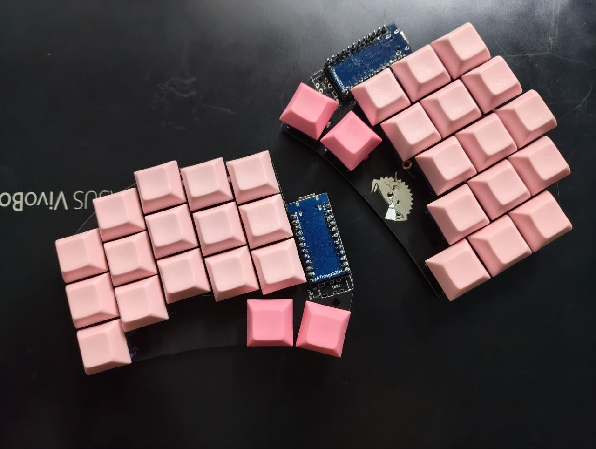
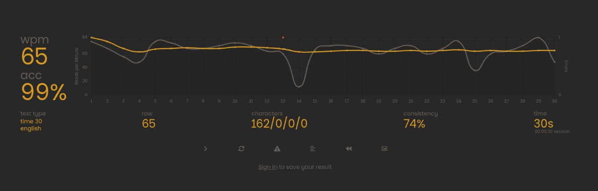

Yeah, excuse the drawing skills—I used to be decent at it, I swear. Anyway, let’s not get distracted by my *propaganda artwork*.

# Keyboard Under 3K INR

Before this rabbit hole even started, I didn’t think much about keyboards. For me, a keyboard was just a tool—an input device to pass bytecode so my computer could do its magic and spit out human-readable code. Nothing more.

That was until I tried my friend’s mechanical keyboard. Typing on it felt *elegant*—like my fingers were finally meant to be there. For the first time, I thought: *Maybe it’s time I upgraded my keyboard.*

And so, the search began.

I set my budget at **3K INR**—not much by enthusiast standards, but it was my starting line. I wanted something customizable, but in this budget, that’s basically a unicorn. I almost settled for the **Cosmic Byte Phantom** or the **EvoFox Ronin**… but curiosity kept pushing me further.

One random YouTube scroll later, I stumbled upon something that completely changed the game. Honestly, I wish I had found it sooner.

# Layout Quest

Most people think **QWERTY** is *the* layout. Some might know about **Dvorak**. But that’s just scratching the surface. There are countless layouts, and even custom ones that you can design yourself.

At that time, I only knew about full-sized, TKL, 70%, and 60% keyboards. Then I discovered something wilder—you can shrink it down even further. Sub-40%, sub-30%… layouts that look insane at first, but make perfect sense once you dive in.

That’s when I found [Prajwal Nadig’s blog](https://www.snprajwal.com/blog/ferricy-custom-split-keyboard/).

* That blog convinced me to build my own split keyboard.
* That blog also convinced me to double my budget—from 3K to **6K INR**.

# Preparation

I decided on the [Ferris Sweep Bling MX](https://github.com/davidphilipbarr/Sweep)—wired version, because I like keeping things simple.

### Components I needed:

* 2× Pro Micro-compatible microcontrollers
* 2× Pin headers
* 34× MX switches
* 34× Kailh hotswap sockets
* 34× Keycaps
* 2× TRRS jacks
* 1× TRRS cable
* 1× USB-C cable

(Optional: reset switches for flashing, but you can just short the pins with a screwdriver if you’re brave enough).

The switch and bottom plate files are in the repo. I skipped the bottom plate since I couldn’t source M2 screws locally.

# My Layout

I mostly stuck to the original layout from the blog, with a few tweaks. Being a *brofessional full-time Vim user™*, I had to prioritize arrows. I mapped them on the right hand—so for example, holding **Backspace** and pressing **N** gives me the **Down Arrow**.

I’ll upload my full layout later, but honestly—you should research and design one that fits *your* workflow. That’s half the fun.

Here’s where I’m at after just 20 days on this keyboard. 🚀
