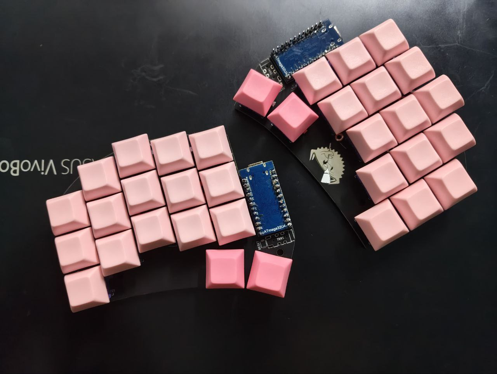
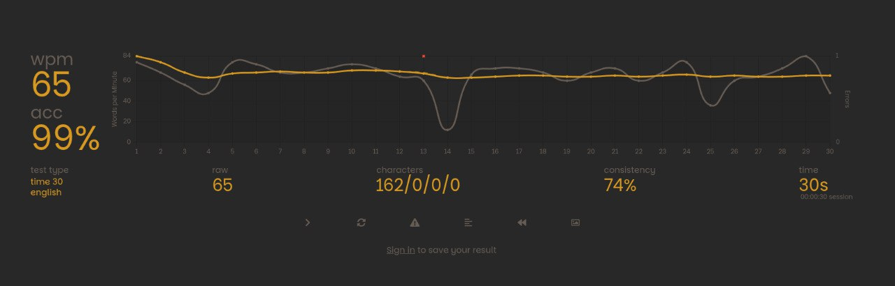

**update**: _previously I wrote this article with llm, now I am writing with bare fingers._

Back in Jul 2025 I decided to purchase a mechanical keyboard, before that I used to use membrane keyboard (yeah ik).
So I started researching which keyboard would satisfy my needs and comes with in my budget (3k INR something).
I have gone through everything about keyboard, like what are switches, normal 
keyboard, split keyboard (the commercial one like kenesis) and many more things about keyboard. By the end of my
research I came to know *man what the holy hell*. 

I would have never imagined that keyboard could be so much expensive like fucking 30k, 60k INR. But anyways as my budget was
not that much I decided to go with cosmic byte.

After placing an order for cosmic byte, at night I stumbled upon a youtube video (cosmic intervention). That video was
talking about self made split ergonomic keyboard (that has only 34 keys in it). [Here the video link.](https://www.youtube.com/watch?v=unMXQTSQEak) 

Upon watching this video made me more curious, I cancelled my order for cosmic byte and started researching again about open source split keyboard
There are many open source keyboards that are available in internet, like crkbd, ferris sweep (this one is mine), dactyle manuform, etc.
Upon everything that's available, I decided to move forward with ferris sweep. Why?
I don't know tbh, if I were to start again then I would have gone with crkbd instead. I followed
this [article](https://www.snprajwal.com/blog/ferricy-custom-split-keyboard/) to
build and configure my ferris sweep. Also this is one of the reason I choosed ferris sweep because at the time of researching
I observed that those who have build these types of keyboards are mainly foreigners. Then one who wrote that article was of my country
(please don't take it in a wrong way, being from the same country assured me that I could get the all the parts for the build). 

Now comes the parts that I hated the most. Sourcing the parts, especially the pcb for board (this alone haunted me for day and night).

When I ordered my pcb from [JLC PCB](https://jlcpcb.com/) I didn't know that time that ordering things from different country
comes with additional import tax. On top of it people on discord said to me that India charges somewhat 70% on import tax if
that was not business related. This shit haunted me so much, I don't have money.
During that time I spend all my money in switches, keycaps, laser cut board and 
other parts of keyboard including a soldering machine. Fortunatly the tax isn't that much that I was expecting but the courier charges are
so unjustified. God Bless India.

So after gathering every parts I build the keyboard (finally). I won't document my build journey cuz there are many like
[this article](https://www.snprajwal.com/blog/ferricy-custom-split-keyboard/). Tho I will share something that I encountered after building.

Without trrs cable both of my keyboard working fine, but when I tried to use both while connecting with trrs the shit doesn's work.
This is the moment I so exhausted. But the reason I found out that the cable I was using is not really trrs (the lable said that is was trrs but it was not).
So I purchased a new cable and it started working fine. One more thing that annoyed me about this proccess is I can't find the
m2 5mm screws (to till this date: 2026-05-02). I am using this keyboard just as it is.

One more thing that I want to highlight in the proccess is, I changed my keyboard layout from qwerty to colemak (because why not).
I thought like I am changing everything thing, why not the layout too.

Anyways, here is my speed after 20 days of using this ferris sweep keyboard.

