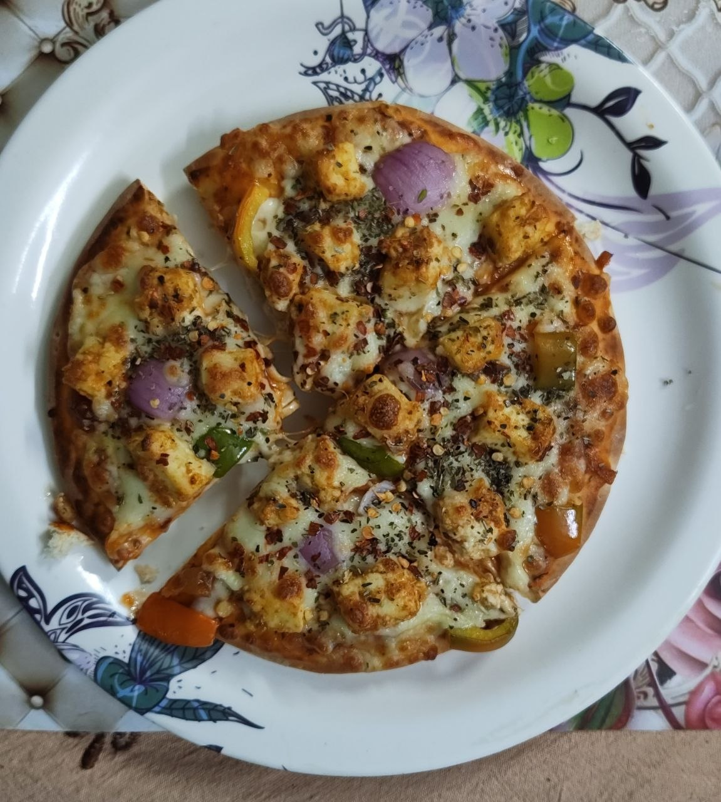
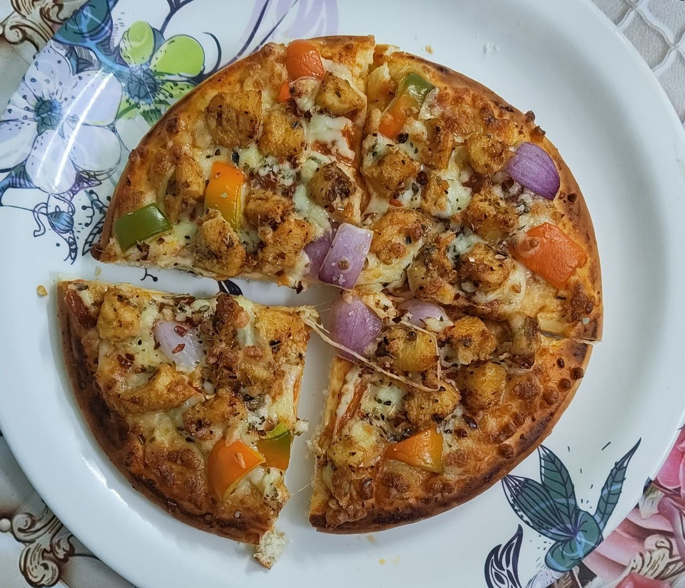

 

Let's make pizza, no bullshit guide. I made 2 pizzas and process are almost same in both.

# Ingredients

- Pizza dough (ofc)
- Pizza pasta sauce (I used knorr ones)
- Mozzarella Cheese
- Chilli flakes & Oregano
- 200gm boneless chicken
- 200gm paneer (you don't need this much)
- Veggies (simla mirch, tomato, onion, olive, etc)

# Chicken Preparation

We first need to cook chicken. To cook chicken we first need to marinate it with
ginger-garlic paste, curd, and other spices. The step are as follows -

- Wash you chicken (cut into small pieces if not)
- After washing chicken put all of that in a bowl
- Add 1 and a half spoon of curd
- Add half spoon of chilli powder
- Add 1 spoon of lemon juice
- Add 2 spoon of ginger-garlic paste
- Add salt & garam masala

Mix it properly until it all looks same in color. Let it marinate for 10-15 mins. After that take a pan
pour in some oil or may be butter, add you marinated chicken into it
and cook it until it becomes somewhat red-dis. After that set aside the
chicken.

# Pizza Preperation

Now comes the part where all dots will connect. This is also very simple tbh, just
follow the below steps -

- Apply pizza sauce to your dough (2-3 spoons)
- Put fuck tons of cheese on top of that dough. 
- Put Chicken on `random.rand()` places on that dough.
- Put Veggies like simla mirch, onion, olive and tomato.
- Apply some cheese again to it.

Now you are almost ready, it's time for cook that kaccha pizza and make it 
pakka pizza. An important note -

**I have a microwave with conventional mode which I can use it as oven.** If you don't have
that it's still possible with other means that you can search on youtube or maybe just
chatgpt. I have seen people making pizza using fry pan too.

Put that pizza in micro-oven set the temperature to 200°C and let it cook for 7-8 mins. After that you
can enjoy the bloody pizza. Up until now this is the recipe of chicken pizza, but
paneer pizza is almost same, you just have replace paneer with chicken.

I did all this in my first try, damn me... Also the photo at the starting of the blog
is paneer pizza and the photo that I put below is chicken pizza (didn't add enough cheese in chicken pizza).

 
