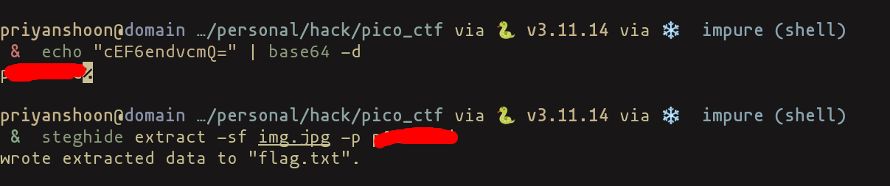

 

This is the problem statement. I have been given an image that contains flag which I have to find.

I checked the metadata of the image using `exiftool`, and there I found comment tag.


The value of that comment tag is `c3RlZ2hpZGU6Y0VGNmVuZHZjbVE9` which looks like base64 encoded
so I decoded this base64 string.

```sh
echo "c3RlZ2hpZGU6Y0VGNmVuZHZjbVE9" | base64 -d
```

By doing this I get `cEF6endvcmQ=`, which is base64 again. So by decoding the second layer.

```sh
echo "cEF6endvcmQ=" | base64 -d
```

we get the password (I am not gonna show the password sorry) :\ .
Then I ran 

```sh
steghide extract -sf img.jpg -p {password}
```

 

Then booyah, I get the flag.txt that contains the flag. 


