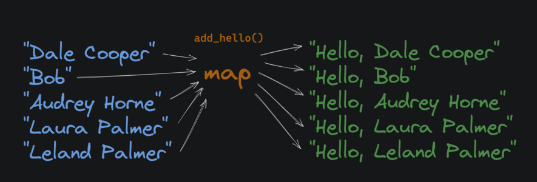
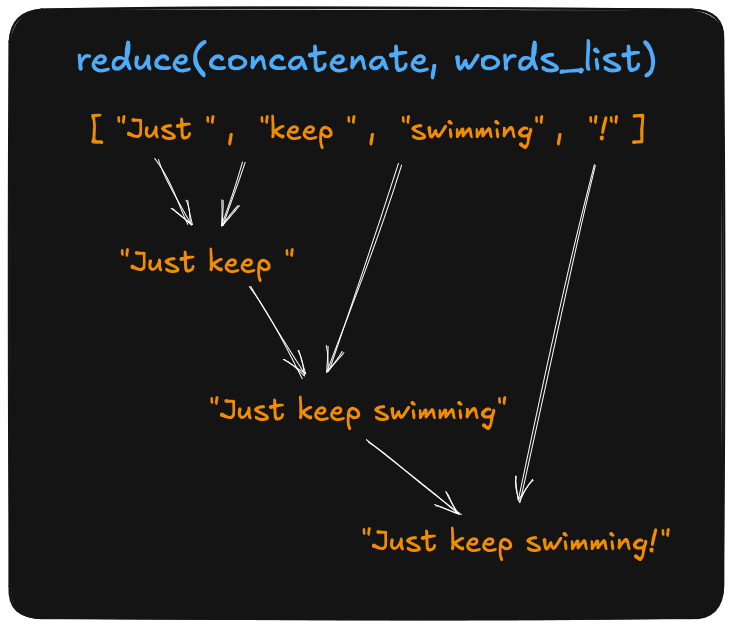

The wikipedia defination of [Higher Order Functions](https://en.wikipedia.org/wiki/Higher-order_function) is -
> In mathematics and computer science, a higher-order function (HOF) is a function that does at least one of the following:
> takes one or more functions as arguments (i.e. a procedural parameter, which is a parameter of a procedure that is itself a procedure),
returns a function as its result.

To understand this more clearly here is a example of First Class Functions.

```python
# this is what we call first class functions
def square(x):
    return x * x

f = square

print(f(2)) # 4
```

**First Class Functions**: The functions that treated like any other values (yes even `None`). This means -
- store them in variables
- pass them as an arguments
- return them from functions
- put them inside a data structure

Now let's see Higher Order Functions

```python
def square(x):
    return x * x

def my_map(func, arg_list): # this is the higher order functions
    result = []
    for i in arg_list:
        result.append(func(i))
    return result

squares = my_map(square, [1, 2, 3, 4, 5])
print(squares)
# [1, 4, 9, 16, 25]
```

**Higher Order Functions**: A function that accepts another function as an arguments or return function.

There is so much into it that I want to discuss, but for now let's focus on python `builtin` functions instead
and let's save those functional topics for upcoming blogs.

I want to discuss 4 builtin functions in python commonly used as higher order functions.

# Map

In Python, the
built-in [map](https://docs.python.org/3/library/functions.html#map) function
takes a function and
an [iterable](https://docs.python.org/3/glossary.html#term-iterable) as inputs.
It returns an iterator that applies the function to
every item, yielding the results.

 

```python
def square(x):
    return x * x

nums = [1, 2, 3, 4, 5]
squared_nums = map(square, nums)

print(list(squared_nums))
# [1, 4, 9, 16, 25]
```

# Fiter
The built-in [filter](https://docs.python.org/3/library/functions.html#filter) function
takes a function and an iterable and returns an iterator
that only contains elements from the original iterable where the result of the
function on that item returned `True`.

 

```python
def is_even(x):
    return x % 2 == 0

numbers = [1, 2, 3, 4, 5, 6]
evens = list(filter(is_even, numbers))
print(evens)
# [2, 4, 6]
```

# Reduce

The builtin [functools.reduce()](https://docs.python.org/3/library/functools.html#functools.reduce) function
takes a function and a list of values, and applies the function to each value
in the list, _accumulating a single result_ as it goes.

<!--   -->

```python
# import functools from the standard library
import functools

def add(sum_so_far, x):
    print(f"sum_so_far: {sum_so_far}, x: {x}")
    return sum_so_far + x

numbers = [1, 2, 3, 4]
sum = functools.reduce(add, numbers)
# sum_so_far: 1, x: 2
# sum_so_far: 3, x: 3
# sum_so_far: 6, x: 4
# 10 doesn't print, it's just the final result
print(sum)
# 10
```

# Zip

The [zip](https://docs.python.org/3/library/functions.html#zip) function takes
two iterables, and returns a _new_ iterable where each
element is a tuple containing one element from each of the original iterables.

```python
a = [1, 2, 3]
b = [4, 5, 6]

c = list(zip(a, b))
print(c)
# [(1, 4), (2, 5), (3, 6)**]
```

**Note: If you spot any mistake in this writing, feel free to contact me and I will correct it.**
