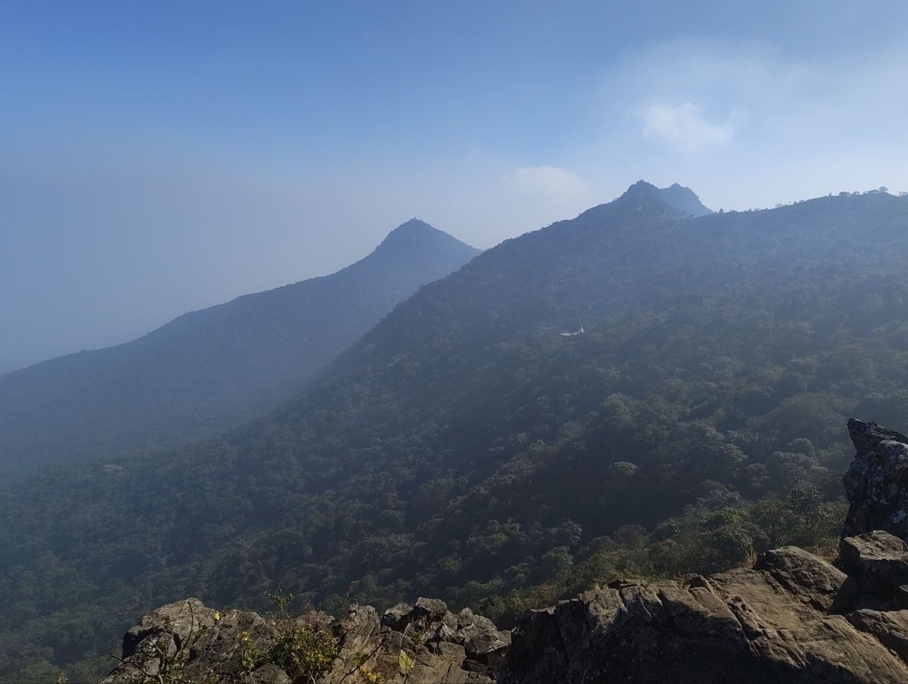

I went on a trip in November 2025 (if I remember correctly). I am a very indoor-type
person; I don’t meet new people or engage with many (not even my 2–3 friends).
I am an introvert. It’s not that I don’t want to engage with people and have a
good time, but I couldn’t let myself do that—I don’t know why. Since childhood,
I have always been told not to make too many friends, not to go here and there,
and so on. So going on that trip was somewhat a tough decision for me. AND I
CHOSE TO GO!

I won’t go on yapping about the trip and all—it was fun, to be honest—but I
want to share the experience I had while trekking the mountain.

Before I tell you about my experience, I must mention that this is not the
first time I have gone trekking. I have been to Jammu & Kashmir (Vaishno Devi
Temple, and many more places) multiple times with my family, but I was very
young then, so I don’t remember much about it. During that time, I was quite an
ignorant kid.

So now let’s talk about the trip I took in November 2025. The place was
Parasnath, Jharkhand, India. There were 10 of us in total. We took a train from
Asansol to Parasnath (no one got a seat, so we had to stand for three straight
hours). After torturing our legs for three hours, we finally reached the
station and had some chai. After that, we went out, took a cab, and drove to
the starting point of the mountain.

# Experience that I had!

I had the most beautiful experience. I didn’t care much about my friends—it was
fine that they were with me—but while I was climbing, my mind became so clear.
I could feel each and every moment; I could literally feel every step I took
during that time. The air gets so clear up there—the fresh air. We started
trekking at night, and after some time, when we reached a higher altitude, we
could see the stars in the sky—so many stars that you can’t see with the naked
eye in normal cities. I can’t put those things into words; it was such an
unparalleled experience. During that time, I was literally shaking due to the
cold, but still, I didn’t feel exhausted while trekking. It felt like something
was pushing me from behind, saying…

> Keep moving forward.

Although I did get exhausted while coming down, at that moment I was still
thinking, “Why does the mountain have to end now? I wish it wouldn’t end.” To
be honest, when I reached the end point, I didn’t feel anything. I was
thinking, “That’s it? It’s over now?” At that particular moment, I realized
that the journey is more fun than the destination. It’s the journey that makes
the destination special and memorable.

I’m glad that I made the decision to go with them. Otherwise, I would have
never experienced this.

<!---->
<!-- I went to a trip on Nov 2025 (if I remember correctly). Let me give you some context -->
<!-- why am I writing this blog now. I very indoor type of person, I don't meet new people -->
<!-- or engage with many (not even my 2-3 friends). I am an introvert. Not that I don't want -->
<!-- to engage with people and have some fun time but I couldn't let myself do that, I don't know why -->
<!-- since childhood I have always been told not to make so much friends, don't go there bla bla bla... So going to that trip -->
<!-- was somewhat a tough decision for me. AND I CHOOSED TO GO! -->
<!---->
<!--   -->
<!---->
<!-- I won't go yapping about the trip and all it was fun tbh, but I want to share the experience -->
<!-- that I had when I was trekking the mountain. -->
<!---->
<!-- Before I tell you about my experience I must tell you that this is not the first time -->
<!-- I am trekking. I have gone Jammu & Kashmir (Vaishno Devi Temple, and many more...) multiple times with family, but -->
<!-- I was very young that time, I don't know much about that. During that time I was a fucking ignorant prick. -->
<!---->
<!-- So now let's talk about the trip that I took in Nov 2025, the place was Parasnath Jharkhand, India. We were -->
<!-- in total of 10 people. Took a train from Asansol to Parasnath (no one got the seat, so we had to stand for straight 3 hours). -->
<!-- After torturing our legs for 3 hours, we finally landed on station and drank chai. After that -->
<!-- we went out took cab and drove to the start point of the mountain.  -->
<!---->
<!-- # Experience that I had! -->
<!---->
<!-- I had the most beautiful experience. I didn't care about my friends much, like it's fine that they were with me -->
<!-- but while I was climbing my mind gets so clear. I can feel each and every moment like I can literally feel every -->
<!-- steps that I took during that time. Air get's so clear up there, the fresh air. We started trekking at night -->
<!-- and after some moment when we came to higher altitude, we can see the stars in the sky (so many stars that you can's see with naked -->
<!-- eyes in normal cities). I can't tell you -->
<!-- those things in word, like it was such a unparallel experience that I had during that time. During that time -->
<!-- the I was literally shaking due to cold, but still I didn't feel exhuasted while trekking. It's itself is pushing -->
<!-- me from the back saying... -->
<!---->
<!-- > Keep moving forward. -->
<!---->
<!-- Although I did get exhausted while coming down, at that moment I was still -->
<!-- thinking, 'Why the fuck does the mountain have to end now? I wish it wouldn’t -->
<!-- end.' Tbh honest, when I get into the ending point, I didn't feel anything, -->
<!-- like I was thinking that's it? It's over now? On that particular point, I realise -->
<!-- that the journey is more fun that to be in destination. It's journey that make -->
<!-- the destination special and memorable. -->
<!---->
<!-- I'm glad that I took this decision to go with them. Otherwise, I would have -->
<!-- never experienced this shit. -->
