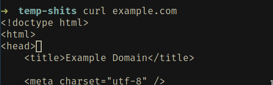
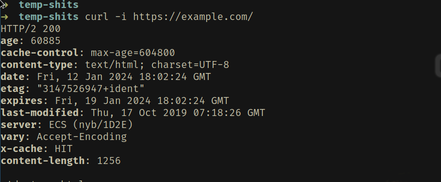
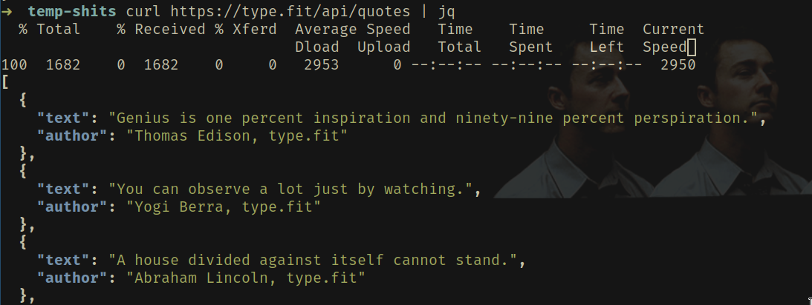
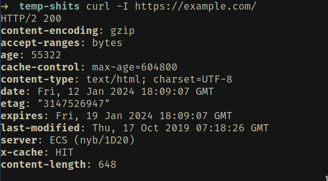
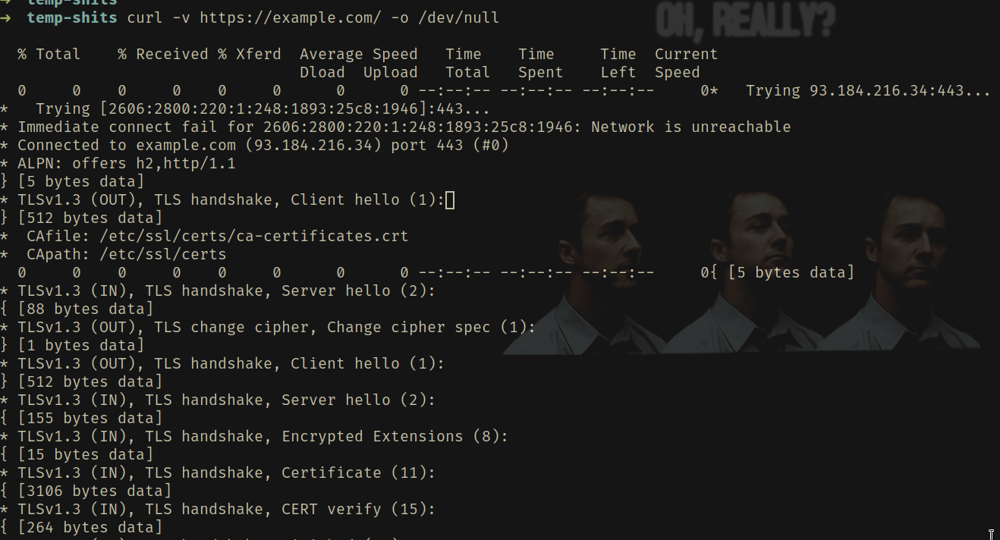

# Indroduction
Curl is a command-line tool to transfer data to or from a server,
using any of the supported protocols (HTTP, FTP, IMAP, POP3, SCP, SFTP, SMTP, TFTP, TELNET, LDAP, or FILE).
This tool is preferred for automation since it is designed to work without user interaction.
curl can transfer multiple files at once.

Curl is also fav among most of the hacker as wall as cracker too.
Curls helps in data scraping and also in API endpoint testing.

Btw before when I was not familiar with curl I used to use postman for api testing (a very good tool)
but it takes too much ram over the time in background. The moment I got taste of true minimalism from Bugswriter (search on yt)
I felt the power. It not only gives me confidence but boost my productivity over time too.

Curl has minimal behavior by default
- Basic set of headers
- No fancy functionality
- Let users enable more when wanted
- Toggle feature on/off one-by-one

```fish
curl [options] [URL...]
```

## Plain curl HTTP GET:
```fish
curl example.com
```


## GET and show me the response headers: \
This will show us the headers content of the network with body.
```fish
curl -i https://example.com/
```


## GET and show JSON nicely:
```fish
curl https://api.api-ninjas.com/v1/quotes\?category\=morning | jq
```


## HEAD only show the response headers:
The line will only show you the header contents of the network.
```fish
curl -I https://example.com/
```


## Follow Redirects if exists:
This will show redirects headers until it ends
```fish
curl -I -L https://example.com/redirects
```

## URL globbing:

This will work as for loop. It goes from 1 to 9 and as follows. Also if you still dont get the
go have a look at python sliceing.
```fish
curl https://example.com/[1-9].html
curl https://example.com/[01-99].html
curl https://example.com/[a-z].html
curl https://example.com/[1-9:2].html
curl https://example.com/[a-z:3].html
```
```-o``` is used to save the html file, we will look -o later in deep.
```fish
curl https://example.com/[1-9].html -o save_#1.html
curl https://example.com/{ham, cheese, banana}.jpg -o save_#1.jpg
curl https://archive.example.com/issue[1996-1999]/vol[1-4]/part{a,b,c}.html
```

## Verbose show more from the underhood
```-v - verbose```
That means print everything while executing.
```fish
curl -v https://example.com/ -o /dev/null
```


## Pass in the custom HTTP headers in curl
Some network needs headers from the client in order to send the requested data,
this is commonly seen in web-scrapping. \
```-H --header```  Extra header to use when getting a web page.
```fish
curl https://example.com/ -H "Magic: disc0"
curl https://example.com/ -H "User-agent: disc0 1n th3 n1gh8"
```

## POST some basic data to the remote
The curl ```-d (or --data)``` command line argument tells
Curl to send the passed data to the server in the body of the HTTP message
```fish
curl -d name=Puchu -i https://example.com/reciever
```

# Conclusion
There is still too much in this tool which I could not cover in this blog. I have covered most of
the topic which is based in daily usages so I guess that shit and if you want to dig more.
into it just google it.
This is the first blog I have ever written
so if you find any mistakes in here feel free to contact me vai telegram or other sources mention in contacts
or just ignore the way you ignore your problems. I am also attaching a video below from where I took these reference.

### [Curl Tutorial](https://youtube.com/watch?v=I6id1Y0YuNk) 
